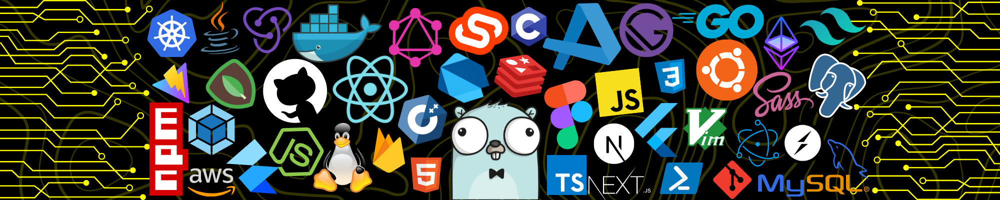

<h1 align="center">Hi 👋, I'm Gautam Prajapat</h1>
<h4 align="center">I am a seasoned Full Stack GenAI Developer with a deep focus on backend engineering, specializing in building and scaling high-performance applications.</h4>

  
  
    
   
  
  

<kbd>
    <kbd>Programming Languages</kbd>
     
      
    
     
     
    
     

  </kbd>
  <kbd>
    <kbd>Front-end</kbd>
     
      
    
     
     
    
     

  </kbd>
  <kbd>
    <kbd>Back-end</kbd>
     
     
    
    
    
  </kbd>
  <kbd>
    <kbd>Database</kbd>
     
     
    
    
    
    
  </kbd>
   

  <kbd>
    <kbd>GenAI</kbd>
     
     
    
    
    
    
  </kbd>
  <kbd>
    <kbd>DevOps</kbd>
     
     
    
    
    
    
  </kbd>
  <kbd>
    <kbd>Tools</kbd>
     
     
    
    
    
  </kbd>
  <kbd>
    <kbd>OS</kbd>
     
     
    
    
    
  </kbd>

---

   

   

<!-- Trophy Stats -->

---

- 🔭 I’m currently working on **CuAssist**

- 🌱 I’m currently learning **GenAI**

- ⚡ Fun fact: I debug faster with coffee ☕

